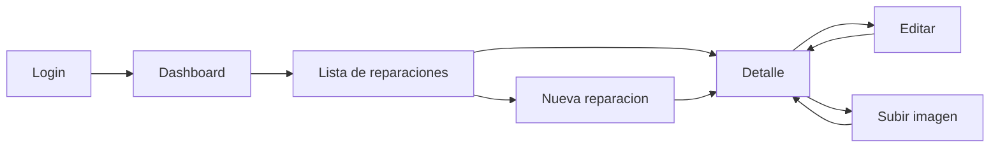

# UX Flow Mobile-First

## Pantallas

1. Login
2. Dashboard
3. Lista de reparaciones
4. Nueva reparacion
5. Detalle de reparacion
6. Editar reparacion

## Flujo Principal

## Reglas Visuales

- Mobile-first, formularios de una columna en celular.
- Dashboard compacto, sin elementos decorativos.
- Estados visibles con badges.
- Botones primarios solo para acciones principales.
- Filtros simples: busqueda, fecha y estado.

## Criterios De Aceptacion UX

- Crear una reparacion requiere pocos campos visibles y no depende de OCR.
- La lista permite encontrar trabajos por marca, modelo o descripcion.
- El detalle muestra costo, porcentaje y ganancia sin navegar a otra pantalla.
- Upload puede usar camara o galeria desde movil.
